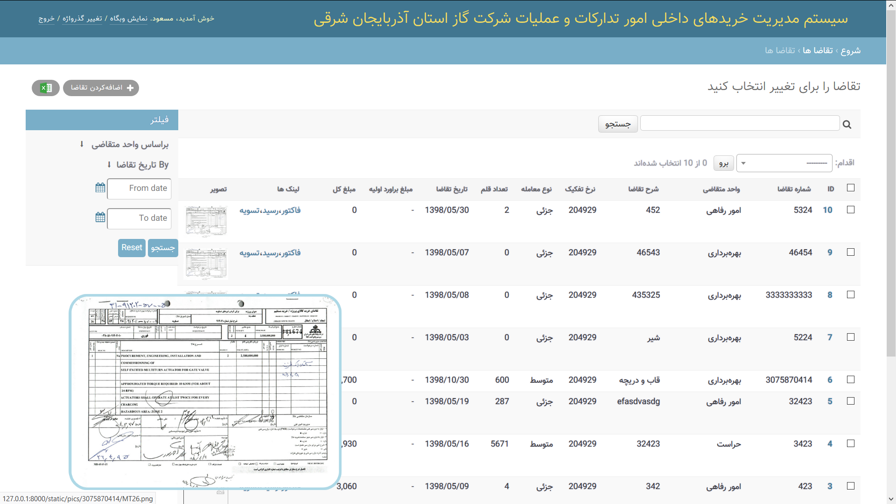
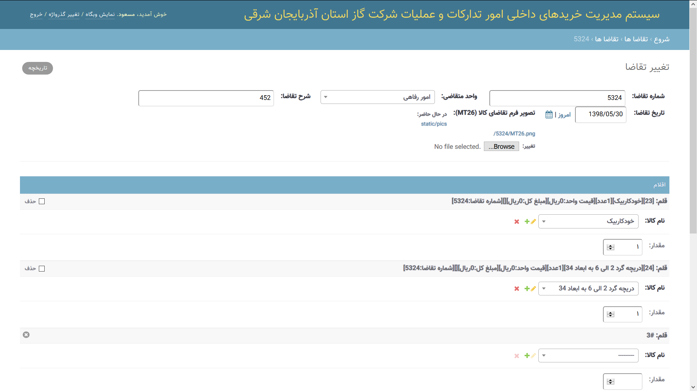

## سیستم مدیریت خرید‌های داخلی امور‌ تدارکات و عملیات شرکت گاز استان آذربایجان شرقی

ساخته شده توسط [فریمورک تحت وب جنگو](https://www.djangoproject.com)

## درباره پروژه:
سیستم مدیریت خرید‌های داخلی امور‌ تدارکات و عملیات شرکت گاز استان آذربایجان شرقی، سیستمی متن باز و برپایه لایسنس GPL می باشد که با توجه به روال های اداری شرکت نفت ایران و فرم های خاص مربوطه، طراحی و توسعه یافته است.
این سیستم در راستای مکانیزه سازی امور بخش های خرید کالای شرکت نفت و گاز توسعه یافته.
لازم به ذکر است با توجه به اینکه این سیستم مثالی فارسی سازی شده از یک «Business Logic» یا «منطق کسب و کار» می باشد، می توان با تغییر یا الگو برداری از بخش های آن، سیستم های با منطق خاص کسب و کار متفاوت را طراحی کرد.
این سیستم قدمی کوچک برای اعلام این موضوع است که، متن باز نمودن برنامه های اداری و دانشگاهی و کسب و کارهای مهم و حیاتی درجهت بهبود، همه فهم بودن و شفافیت نقش مهمی را ایفا می کند و تسریع اشتراک تکنولوژی مدرن اداری بین شعب و نهادهای دیگر را تسهیل می کند.

## چگونه ... ؟

### روش نصب و اجرا:

1. فایل ها را با استفاده از دکمه سبز دانلود و از حالت فشرده خارج کنید
3.  [پایتون](https://www.python.org/) یا [آناکوندا](https://www.anaconda.com/) را دانلود و نصب کنید
4. خط فرمان را اجرا و دستورات زیر را در آن اجرا نمایید:

    1. cd { جایی که فایل فشرده را استخراج کردید،برای مثال  : C:\Downloads\Chortke\ } 
    2. pip install -r requirments.txt 
    3. python manage.py makemigrations 
    4. python manage.py migrate 
    5. python manage.py createsuperuser 
    6. python manage.py runserver 

5. لینک روبرو را در مرورگر خود اجرا نمایید : http://127.0.0.1:8000
   
## محیط برنامه:

    
    
    
    
    <!--  -->
    <!--  -->
    <!--  -->
    <!--  -->
    <!--  -->
    <!--  -->
    <!--  -->

# درباره برنامه نویس:

   
   مسعود عزیزی  
   ایران، تبریز  
   mablue92@gmail.com  
   09149992598  
    
    
    
    

## Specialized Procurement and Sales Management System for East Azarbaijan Gas Company:

based on: [Django Web Framework](https://www.djangoproject.com)

## About the project:
Procurement and Operations Management System of Internal Procurement Affairs of East Azarbaijan Gas Company is an open source GPL license system designed and developed according to Iranian Oil Company administrative procedures and related forms. This system is developed to mechanize the affairs of the oil and gas company. It should be noted that since this system is a Persianized example of a "Business Logic" or "Business Logic", one can modify or model its components, systems with specific business logic. Designed differently. This system is a small step towards announcing that, opening up office and academic programs and critical businesses for improvement, all understanding and transparency plays an important role, and accelerating the sharing of modern office technology between branches and institutions. Facilitates the other.

## How To ... ?

### Installation:

1. Download and extract zip file
3. Download & install [python](https://www.python.org/) or [anaconda](https://www.anaconda.com/)softwere on your Computer
4. open cmd and run these commands:
    1. cd { extracted files folder directory 4 ex: C:\Downloads\Chortke\ }
    2. pip install -r requirments.txt
    3. python manage.py makemigrations
    4. python manage.py migrate
    5. python manage.py createsuperuser
    6. python manage.py runserver
5. open this link: http://127.0.0.1:8000
   
## Screenshots:

    
    
    
    
    <!--  -->
    <!--  -->
    <!--  -->
    <!--  -->
    <!--  -->
    <!--  -->
    <!--  -->

# About Developer:

   
   Masoud Azizi  
   Tabriz, Iran  
   mablue92@gmail.com  
   +989149992598  
    
    
    
    

